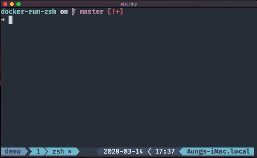

# docker-run-zsh

> docker-run-zsh

## Usage



### Docker Run

```shell
rdk imageName port
```

### Docker Detached Mode

```shell
rdkd imageName port
```

**current dir is mounted on /src of container**

_EXPOSE port is optional_

## Installation

### [ oh-my-zsh ](https://github.com/ohmyzsh/ohmyzsh)

```shell
git clone https://github.com/AungMyoKyaw/docker-run-zsh ~/.oh-my-zsh/custom/plugins/docker-run-zsh
```

_add to plugin list_

```shell
plugins=(… docker-run-zsh)
```

### [ antibody ](https://getantibody.github.io/usage/)

_add to .zsh_plugins.txt_

```shell
AungMyoKyaw/docker-run-zsh
```

_and reload_

```shell
antibody bundle < ~/.zsh_plugins.txt > ~/.zsh_plugins.sh
antibody update
source ~/.zshrc
```

## LICENSE

MIT © [Aung Myo Kyaw](https://github.com/AungMyoKyaw)
